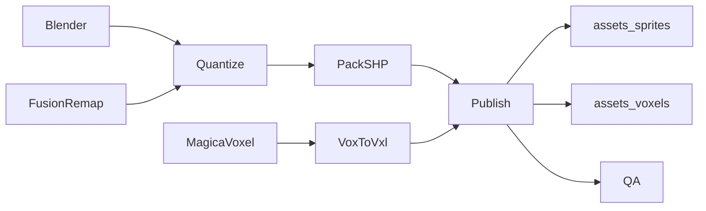

# Westwood 级 SHP / VXL 资产流水线

OpenRA2 支持两条资产路径：

| 路径 | 工具 | 用途 |
|------|------|------|
| **提取** | [`tools/ra2pack/gen_assets.py`](../tools/ra2pack/gen_assets.py) | 从本机 RA2/YR MIX 抽出官方素材 |
| **生产** | [`tools/asset_pipeline/`](../tools/asset_pipeline/) | 原创 / 融合兵种（本文件） |

二者最终都写入同一契约：`assets/sprites/`（PNG）与 `assets/voxels/`（VXL），引擎命名见 `gen_assets.py` / `vxl.cpp`。

## 怎么用（最短路径）

### A. 融合阵营补齐（PLA / 99式）

前提：已跑过 `gen_assets.py`（有 `unit_conscript_*`、`unit_rhino_*`、`turret_rhino_*`）。

一键（推荐）：

```text
python tools/ra2pack/make_fusion_units.py
```

等价分步：

```text
python tools/asset_pipeline/prepare_fusion_units.py
python tools/asset_pipeline/publish_unit.py --manifest tools/asset_pipeline/templates/pla/manifest.yaml
python tools/asset_pipeline/publish_unit.py --manifest tools/asset_pipeline/templates/type99/manifest.yaml
python tools/asset_pipeline/qa_check.py --manifest tools/asset_pipeline/templates/pla/manifest.yaml
python tools/asset_pipeline/qa_check.py --manifest tools/asset_pipeline/templates/type99/manifest.yaml
```

| 单位 | kind | 清单 | 引擎注意 |
|------|------|------|----------|
| PLA | `infantry` | `templates/pla/` | 站/走/射/死/部署全帧 |
| Type99 | `vehicle_png` | `templates/type99/` | 车体+炮塔 PNG；`vxl.cpp` stems 为 null，不走犀牛 VXL |

验收：两行 `QA PASS`；局内造兵可见草绿帽沿（PLA）与附加装甲块（99式），且与动员兵/犀牛不完全同图。

### B. 全新步兵（Blender 或手绘）

1. 复制 `templates/infantry_unit/`，改 `manifest.yaml` 的 `id`（= `unitAssetName`）。
2. 把 PNG 放进 `fixtures/<anim>/<facing>_<frame>.png`（如 `stand/2_00.png`），或用 Blender：

```text
blender --background --python tools/asset_pipeline/blender/ra2_iso_render.py -- \
  --out path/to/renders --demo --anim stand --frames 1 --canvas 24 30 --supersample 2
```

3. `publish_unit.py` → `qa_check.py`。
4. 若引擎尚无该 `UnitType`，再改 `world`/`assets.h`（本流水线只负责像素契约）。

### C. 全新战车（MagicaVoxel → VXL）

1. `manifest.yaml`：`kind: vehicle`，`source_dir` 含 `<stem>.vox`（可选 `tur`/`barl`）。
2. `publish_unit.py` → `assets/voxels/<stem>.vxl` + `.hva`。
3. 可选：VXLSE III 抛光后拷回。

尚无 `.vox`、只有等距 PNG 时用 **`kind: vehicle_png`**（见 Type99）。

## 现实边界

- **技术上可对标 Westwood**：`unittem.pal` 索引、remap 16–31、阴影 index 1、8 朝向、infantry sequence、等距相机、SHP(TS)、VXL section。
- **“更高画质”= 流程能力**：2×/4× 烘图再 NEAREST 缩回原作尺度、硬 QA、可复现构建——**不是**自动画出超过原厂的造型。
- **默认创作入口**：Blender（步兵）+ MagicaVoxel（战车）。不依赖 3ds Max。



## 调色板与 Remap

- 权威调色板：`assets/palettes/unittem.pal`（从 MIX 抽出）。
- **index 0**：透明。
- **index 1**：阴影（运行时半透明黑，勿当普通色）。
- **index 16–31**：阵营 remap（美术里画纯红 `(255,0,0)` 一带，流水线会压进该段）。
- 量化默认**无抖动**（更接近原作硬边）。

## 朝向与相机

- 8 朝向，**逆时针 45°**；facing 0 ≈ 屏幕东（与 OpenRA2 / art.ini 一致）。
- Blender 脚本：[`tools/asset_pipeline/blender/ra2_iso_render.py`](../tools/asset_pipeline/blender/ra2_iso_render.py)
  - 正交相机，俯仰 ≈ 35.264°，方位 45°（经典等距）。
  - 主光左上，透明底 PNG。
  - `--supersample 2` 后 NEAREST 缩到 `canvas`。

无 Blender 时：用手绘 / 导出的 PNG 放进 `fixtures/<anim>/<facing>_00.png` 即可。

## 步兵（SHP 路径）

产出：

- `assets/sprites/unit_<id>_d*_f*.png`（及 walk/fire/die/dep 若清单声明）
- `assets/sprites/icon_unit_<id>.png`
- 更新 `assets/sprites/anims.ini` 对应段
- 主文件：`tools/asset_pipeline/out/<id>/<id>.shp`（SHP(TS) raw 帧）

QA 硬失败：缺朝向、画布不对、无 remap、底锚全透明、与 `qa.not_identical_to` 参照单位字节相同。

## 战车

| kind | 输入 | 产出 |
|------|------|------|
| `vehicle` | MagicaVoxel `.vox` | `assets/voxels/<stem>.vxl` + `.hva` |
| `vehicle_png` | `fixtures/stand/` + 可选 `fixtures/turret/` | `unit_<id>_*.png`、`turret_<id>_*.png`、icon、SHP 主文件 |

## 地形是不是「真 3D」？（不要改成网格地形）

**结论：RA2 地面视觉上的立体感 ≠ 3D 网格地形；OpenRA2 不应为此重写成 true-3D mesh。**

原作做法是 **2.5D 等距**：

| 层 | 原作 | 作用 |
|----|------|------|
| 地砖 | **TMP** 模板（菱形格约 60×30，多图块/cliff extra） | 像素画出来的“坡面/悬崖”，不是三角网格 |
| 高度 | 地图格 **Height**（IsoMapPack 等） | 抬升绘制顺序与落点，制造台阶感 |
| 单位 | 步兵 **SHP**；载具 **VXL**（体素再投影成 2D） | 车是真体素资产，地不是 |
| 相机 | 固定等距正交视角 | 无自由 3D 镜头 |

因此：

- **该改的**：更好的 TMP 提取/变体/岸线；格高度字段已预留（存档 V17），**默认生成全 0**——随机丘陵 + blit 抬升会破坏 TMP 一体感，未作为默认观感。
- **不该改的**：把地表换成 heightmap mesh / 透视相机来“更像 3D”。

### YR 站姿 PNG（无 MIX 全量时）

已有 `assets/voxels/*.vxl` 时：

```text
python tools/ra2pack/render_vxl_pngs.py
```

写出 `unit_<eng>_d*_f0.png`（及 turret/icon）。

## 更高水平（美术迭代，非自动）

- 2×/4× 烘图再缩回；单独修 silhouette 与脚底锚点。
- 步兵补全 Walk/Fire/Die/Prone sequence（清单 `sequences` + `anims.ini`）。
- 战车：VXLSE 抛光；或为 Type99 做真 `.vox` 后改 `kind: vehicle`。
- 对照原作截图做 side-by-side QA。

## 模块索引

| 文件 | 作用 |
|------|------|
| [`formats.py`](../tools/asset_pipeline/formats.py) | 量化、pack SHP、VOX→VXL/HVA |
| [`prepare_fusion_units.py`](../tools/asset_pipeline/prepare_fusion_units.py) | 动员兵/犀牛 → PLA/99 式 fixtures |
| [`publish_unit.py`](../tools/asset_pipeline/publish_unit.py) | 清单 → assets |
| [`qa_check.py`](../tools/asset_pipeline/qa_check.py) | 硬门禁 |
| [`blender/ra2_iso_render.py`](../tools/asset_pipeline/blender/ra2_iso_render.py) | 等距批烘 |
| [`templates/pla/`](../tools/asset_pipeline/templates/pla/) / [`type99/`](../tools/asset_pipeline/templates/type99/) | 融合单位清单 |

**禁止**：用 C++ `--gen-assets` 写程序占位图（已禁用）。缺帧应让流水线失败，而不是静默生成方块人。
